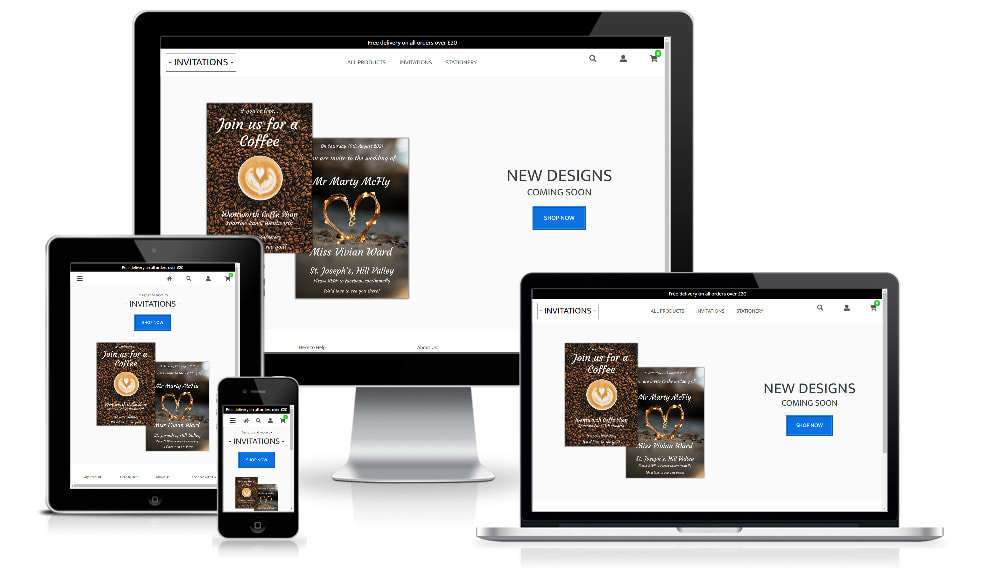

# Invitations

The live deployed app can be accessed using the following link: [-INVITATIONS-](https://devtog-invitations.herokuapp.com/)

## Table of Contents
- [Summary](#summary)
- [Business Goals](#business-goals)
- [Customer Goals](#customer-goals)
- [UX](#ux)
  * [Ideal Customer](#ideal-customer)
  * [Ideal Administrator](#ideal-administrator)
- [User Stories](#user-stories)
  * [Customer](#customer-stories)
  * [Administrator](#administrator-stories)
- [Information Architecture](#information-architecture)
- [Wireframe Designs](#wireframe-designs)
- [Surface](#surface)
- [Code File Structure](#code-file-structure)
- [Technologies Used](#technologies-used)
- [Features](#features)
- [Future Features](#future-features)
- [Defensive design](#defensive-design)
- [Testing](#testing)
- [Running Locally and Deployment](#running-locally-and-deployment)
- [Credits](#credits)
  * [Text content](#text-content)
  * [Logo](#logo)
  * [Photos](#photos-and-invites)
  * [Code](#code)
- [Acknowledgments](#acknowledgments)
- [Disclaimer](#disclaimer)

## Summary
The purpose of the ‘Invitations’ project is to create an app which will allow users to find & purchase invitation designs to personalise. After purchase they can then download the invite and either print or email them.  As well as invitations the app will also offer other items which could compliment the invites. i.e. Envelopes, paper, markers, etc.

## Business Goals

- Create an easy to use app which will keep users coming back time-after-time with a growing collection of customisable invitation designs and other products.
- Allow customers to buy customised invite downloads and other products.

## Customer Goals
- Search for products of interest.
- Easy to find the information so they can make an informed decision.
- Purchase invites or products they wish to buy.
- Personalise invites.

## Administrator Goals
- Ability to maintain the site, add, update and delete products.
- Ability to maintain customer orders.
- Ability to maintain the site FAQ list.

## UX

### Ideal Customer
- English speaking (UK & Ireland based/visiting)
- Looking for invitation design(s) for themselves or the family.

### Ideal Administrator
- Responsible member of the business.
- English speaking (UK & Ireland based)

## User Stories

### Customer Stories
1. How do I search for products using a word or phrase?
2. How do I find products by category?
3. How do I find newly listed products?
4. How do I find featured products?
5. How can I view more details about a product?
6. How do I add products to my shopping cart?
7. How can I view/edit my shopping cart contents?
8. How can I personalise an invite?
9. How do I checkout and pay?
10. How can I view my previous orders?
11. How do I update my profile information?
12. How do I review a product I have purchased?
13. How can I edit a review I have made?
14. How can I delete a review I have made?

### Administrator Stories
1. How do I maintain the products?
2. How do I maintain the order information?
3. How do I maintain the FAQs?
4. How do I maintain the product reviews?
5. How do I maintain the product categories?
6. How do I maintain the user accounts?

## Information Architecture
### Database Choice
For this project I chose to use the Postgres database system as this is the one I was more familar with, as we used it in the Django modules of the course.

### User Authentication
For user authentication I chose to use the allauth package as this is what we used on the course and I was most familar with.

### Django Models (database tables)
The 'Invitations' database has 7 models/tables, above and beyond the ones provided by Django and the allauth package.

 

**Category**

Stores all the product categories available, and is part of the 'Product' app.

| Field name    | Data Type | Length |Null allowed? | Notes |
| --- | ---- | --- | ---- | --- |
|id | IntegerField |    | No | primary key (pk), automatically generated by Postgres |
|name | CharField | 254 | No |   |
|display_name | CharField | 254 | Yes |   |

 

**Product**

Stores all the products available, and is part of the 'products' app.

| Field name    | Data Type | Length |Null allowed? | Notes |
| --- | ---- | --- | ---- | --- |
|id | IntegerField |    | No | primary key (pk), automatically generated by Postgres |
|category_id | IntegerField |    | Yes | ForeignKey(**Category**, Many-To-One)|
|name | CharField |   | No |   |
|price | DecimalField | 6,2 | No |   |
|description | TextField |   | No |   |
|custromisable | BoolField |   | No |   | is this product a customisable invite
|view_image | ImageField |  | No |   | product view image used by all products
|raw_image | ImageField |  | Yes |   | an invites raw full res file used for generating the final invite
|customize_image | ImageField |  | Yes |   | watermarked invite image used for on-screen personalising
|featured | booleanField |   | Yes | is this a featured product |
|date_created | DateTimeField |   | No | the date the product was added, default now |
|average_rating | DecimalField | 2 | No | system generated on review changes, default 0.0 |

 

**CustomDetailLines**

Stores the customising/personalising element data for an invite product.

| Field name    | Data Type | Length |Null allowed? | Notes |
| --- | ---- | --- | ---- | --- |
|id | IntegerField |    | No | primary key (pk), automatically generated by Postgres |
|product_id | IntegerField |    | No | ForeignKey(**Product**, Many-To-One) - product the design layout is for |
|date | DateTimeField |   | No | the date the review was made |
|text | CharField | 60  | No | text to appear on the invite  |
|y_pos | IntegerField |   | No | vertical pre-determined position of the layout element|
|font | CharField | 60  | No | font to use for the element, chosen from a list |
|raw_size | CharField | 3  | No | raw font size in relation to the full-size invite |
|color | ColorField |   | No | color to use for the elements text, default #000000 |
|stroke_fill | ColorField |   | No | color to use for the elements stroke, default #000000 |
|stroke_width | CharField | 3  | No | width to use for the elements stroke |

 

**Order**

Stores all the order information, and is part of the 'checkout' app.

| Field name    | Data Type | Length |Null allowed? | Notes |
| --- | ---- | --- | --- | --- |
|id | IntegerField |    | No | primary key (pk), automatically generated by Postgres |
|user_profile_id | IntegerField |    | Yes | ForeignKey(**UserProfile**, Many-To-One)|
|fullname | CharField | 50 | No |   |
|email | CharField | 254 | No |   |
|telephone | CharField | 25 | No |   |
|address_line1 | CharField | 80 | No |   |
|address_line2 | CharField | 80 | Yes |   |
|town_or_city | CharField | 45 | No |   |
|county | CharField | 80 | Yes |   |
|postcode | CharField | 80 | Yes |   |
|country | CharField | 2 | No |   |
|order_date | DateTimeField |   | No |   |
|order_total | DecimalField | 10,2 | No |   |
|delivery_cost | DecimalField | 6,2 | No |   |
|grand_total | DecimalField | 10,2 | No |   |
|original_cart | TextField |   | No |   |
|stripe_pid | CharField | 254 | No | payment id from Stripe |

 

**OrderLineItem**

Stores all the order line item information, and is part of the 'checkout' app.

| Field name    | Data Type | Length | Null allowed? | Notes |
| --- | ---- | --- | ---- | --- |
|id | IntegerField |    | No | primary key (pk), automatically generated by Postgres |
|order_id | IntegerField |    | No | ForeignKey(**Order**, Many-To-One)|
|product_id | IntegerField |    | No | ForeignKey(**Product**, Many-To-One)|
|qty | IntegerField |   | No |   |
|lineitem_total | DecimalField | 6,2 | No |   |
|invite_data | TextField |   | Yes |   |

 

**Reviews**

Stores user product reviews, and is part of the 'product' app.

| Field name    | Data Type | Length |Null allowed? | Notes |
| --- | ---- | --- | ---- | --- |
|id | IntegerField |    | No | primary key (pk), automatically generated by Postgres |
|user_profile_id | IntegerField |    | No | ForeignKey(**UserProfile**, Many-To-One) - user placing the review|
|product_id | IntegerField |    | No | ForeignKey(**Product**, Many-To-One) - product being reviewed |
|date | DateTimeField |   | No | the date the review was made |
|comment | CharField |   | No | short review feedback  |
|rating | IntegerField |   | No | user rating 1 - 5 |

 

**Faq**

Stores all the site FAQs, storing them in a table makes it easier for site admin to add/amend/delete
and change the display order.

| Field name    | Data Type | Length |Null allowed? | Notes |
| --- | ---- | --- | ---- | --- |
|id | IntegerField |    | No | primary key (pk), automatically generated by Postgres |
|question | CharField |    | No | the question |
|answer | TextField |   | Yes | the answer to the question |
|display | IntegerField |   | Yes | value 1-100, defines the display order 1 being the highest, default=50|

 

## Wireframe Designs

The [Wireframes](/docs/wireframes/) for the site are located in /docs/customer_stories/

## Surface
From the beginning I wanted this app to have a very clean modern feel, where possible.

For the buttons on the site I have kept with some of the standard Bootstrap colors, not just because they are already configured, but I instantly liked the way they popped of the page, in contrast to the general black, white and grey feel of the other page elements.

The font chosen for the site is google fonts 'Mukta', sans-serif', chosen for it's crisp feel and it looks as good large as it does smaller, and for that reason I chose to just use one font for the site.

## Code File Structure
The 'Invitations' project app is made up of the following apps, apart from the main invitations app itself:

- home : Displays the home page, and other static text pages such as 'Our Story, T+Cs, Privacy, Delivery, Contact Us, etc'
- products : Handles the display of product search results and product detail display.
- cart : Handles the display, add, edit and remove of items from the shopping cart.
- checkout : Handles the checkout process including Stripe.
- profiles : Displays the user profile, order history summary, and users reviews.
- reviews : Handles the user adding, editing and deleting their reviews.
- faq : Handles the display, add, edit and remove of the sites FAQs

## Technologies Used
- HTML
- CSS
- JavaScript
- Python
- Django - web framework
- Jinja - template language
- Bootstrap v4.5
- Fontawesome - free icons
- [Google Fonts](https://fonts.google.com/) - for the site font, and also the personalisation fonts.
- [Optimizilla](https://imagecompressor.com/) - used to compress JPEG/PNG content.

## Features
All the app pages have a responsive navigation bar with logo top-left, clicking the logo will take the user to the Home page. 
The nav-bar is sticky and remains at the top of all pages, so basic navigation is always at hand. 

On smaller screens and mobiles the product categories are collapsed into a mobile style burger menu, and the main logo is not displayed, however a home icon is added to the navbar so it is easy for the user to get back to the home page at any time.

The invite collage is only displayed on the home page.

The navbar icons will take the user to the appropriate page:
- Magnifying glass: will open a text search modal and allow the user to search products by word or phrase
- User: will show the user profile menu options
- Shopping Cart: show the shopping cart page

At the bottom of all app pages is the footer which has links for:
- My Account: Login/Register, Profile, Logout  (these alter depending on if a user is logged-in)
- Here to Help: Contact Us, Delivery Information, FAQs
- About Us: Our Story, Terms & Conditions, Privacy Policy
- Connect with Us: Social media links for Instagram, Facebook & Twitter

Throughout the app django pop-up toast messages are used to keep the user informed where possible.

[Home page](https://devtog-invitations.herokuapp.com/)

A simple two invite hero-image is displayed to the left with some text and a [Shop Now] button to the right.

The [Shop Now] button takes the user to the products results page and display all the products.

On smaller screens and mobiles the text is removed and replaced by a logo and along with the [Shop Now] 
button they are displayed above the hero-image.

[Products Results page](https://devtog-invitations.herokuapp.com/products/)

This page displays the results of a product search, the title is dynamically changed to reflect the results 
being shown.

Each product is summarised in a card which depending on the screen size will display in columns of 4, 3, 2 or 1.

Each card is made up of a product image, truncated name, price, category, review rating.  If a super-user is logged-in then a red [Edit] button is displayed in the bottom right-hand corner.

Clicking anywhere above the category will take the user to the product detail page.

On the right-edge of the screen is an up-arrow icon which at any point when clicked will take the user to the top of the page.

At the top of the page or in the 'hamburger' menu on smaller devices are the product category search options. Choosing any of these will show the 'Product Results' page with the requested results.

[Products Detail page](https://devtog-invitations.herokuapp.com/products/15/)

This page displays the product details.

On the left side is the product image and to the right the product details: name, category, price, description and review rating.  If a super-user is logged-in then a red [Edit] button is displayed at the bottom right-hand corner.

To the right of the price is the quantity input field with '+' '-' icons to change the quantity, and below this is the [Add to Cart] button.

Clicking [Add to Cart] will add the quantity to the users cart and display a pop-up message with the details, this message also contains a [Checkout] button which would take the user to the 'Checkout' page

Clicking on the review stars will show the user reviews below the product image.

On smaller screens and mobiles the product details are shown below the product image.

[Shopping Cart page](https://devtog-invitations.herokuapp.com/cart/)

This page displays the users shopping cart.

On the left side is a list of the cart contents: product image, name, price, qty and product total. If a cart item is an invite then a [View/Edit] button will be displayed below it's image to allow the user to make any last minute changes, prior to purchase. (the cart is automatically updated when the user returns from the view/edit)

Below the item list are two buttons [Shop More] which takes the user back to a 'Product Results' page and the [Update Cart] button, which will update the cart with any quantity changes made to the cart items.

To the right of the item list is a summary of the shopping cart totals and a [Checkout] button, which when clicked will take the user to the 'Checkout' page.

On smaller screens and mobiles the summary and [Checkout] button are displayed above the item list.

[Checkout page](https://devtog-invitations.herokuapp.com/checkout/)

This page displays the checkout details and order-form.

On the left side an order summary show a list of the items in the shopping cart(image, name, qty & sub-total) and below this are the order totals for(order, delivery & grand total).

To the right is the order-form and the [Pay Now] button which when clicked will attempt to contact Stripe and take the users payment, if successful an order confirmation message and screen will be shown, detailing what the user has ordered.

[Checkout - Success confirmation page](#)

This page displays order and product details of what the customer has just ordered.

[Profile page](https://devtog-invitations.herokuapp.com/profile/)

This page displays user details, order history and reviews made.

To the left is a 'Order History' list showing what orders the user has placed, clicking on an order will show the user the original order confirmation detailing what was ordered and allow the user to review a purchased product.

To the right is the 'User Details' form which they can use to edit their details and then update using the [Update] button below.

Below these is a 'My Product Reviews' section which lists the reviews a user has made, clicking on a review will allow the user to edit or delete the review.

On smaller screens and mobiles the elements are re-ordered so that the 'User Details' form is at the top, with 'Order History' and 'My Product Reviews' below.

[Profile - Previous order confirmation](#)

This page shows the same information as the 'Success confirmation' page only now there is a [Review Product] button below each order item, which when clicked will allow the user to add a review for that product.

Below the order details are two buttons [Shop Now] which takes the user to a 'Products Results' page and a [My Profile] button which will take the user back to their profile page.

[Product Review page](#)

This page allows the user to add, edit or delete their reviews.

To the left is the product image and on the right is the product name and a form allowing the user to enter a short comment and select a rating from 1 to 5. The button will dynamically change between [Add Review] and [Update Review] depending on review action being done.

When editing a review a 'Delete' checkbox is shown which if checked will delete the review when the [Update Review] button is clicked. (the user will be prompted to make sure)

## Future Features
- Ability for users to make design requests if they cannot find a suitable invite
- Have Left/Centre/Right justify text options when personalising an invite
- Implement some 'Pagination' as the database grows, to make product navigation easier.
- Allow users to download their personalised invite from their profile page.

## Defensive Design
- If the user attempts to access an unknown page/route then a page will be displayed to help them return to the home page.
- Where possible I have coded the app to prevent unauthorized editing via the URL when trying to:
    - View an order confirmation that was not your order
    - Review a product you have not purchased
    - Create a review when not logged-in.
    - Create a review for a product which does not exist or is invalid.
    - Create a review for a product you did not buy.
    - If a user attempts to alter input fields by remove the 'required' attribute when submitting a form.

## Testing
For testing information please use the following link [TESTING.md](/TESTING.md)

## Running Locally and Deployment
For running locally and deployment information please use the following link [DEPLOYMENT.md](/DEPLOYMENT.md)

## Credits
### Text content
All stationery product titles/text have been copied from various other product realted sites, such as Amazon, Google, Ebay, etc. In some areas I have slightly altered text and for some products just made it up.  If this was not an educational project then all product text would be written in-house or provided by our suppliers.

The 'Privacy Policy' and 'Terms & Conditions' text were copied from a website template on [Website Planet](https://www.websiteplanet.com/blog/make-privacy-policy-gdpr-compliant/)

The 'Delivery' text was copied from [Rymans](https://www.ryman.co.uk/delivery-options). If this was not an educational project I would have written our own, or obtained a commercially available template.

Any trademark names used remain the property of their copyright owner. If this was not an educational project then some products would probably have different names.

### Logo
The 'Invitations' logo is just simple text with a border.

### Photos and Invites
The home-page collage was created by myself.

All stationery product photos have been copied from various other product related sites, such as Amazon, Google, Ebay, etc. If this was not an educational project then all these photos would be taken in-house or provided by our suppliers.

All invite layouts were designed by myself, if an invite uses a photo then this has been taken from Unsplash.com or google. Again if this was not an educational project then permission would have been sought prior to their use.

### Invite Fonts
All the fonts used to personalise invites are from 'Google Fonts' which I believe are free to use as they are released under open source licenses. However if this was not an educational project I would confirm this.

### Code
Thanks to the Stackoverflow, W3 and other communities & blogs for helping solve some issues/problems along the way.  Details listed below:
- [Change Bootstrap Hamburger Toggler by Amirreza Mohammadi](https://stackoverflow.com/questions/42586729/bootstrap-4-change-hamburger-toggler-color)
- [CSS to remove caret from Bootstrap dropdown by FluffyKitten](https://stackoverflow.com/questions/62964610/css-class-to-remove-caret-in-bootstrap-dropdown-menu-being-ignored)
- [jQuery - back to the top of the page by Explosion Pills](https://stackoverflow.com/questions/14249998/jquery-back-to-top)
- [Format date created in product admin.py](https://gist.github.com/bee-keeper/e9c69e757b529fcffeda)
- [Iterate and get index by NPE](https://stackoverflow.com/questions/4547256/python-default-counter-variable-in-for-loop/4547270)
- [Padding a string in Python by PhE](https://stackoverflow.com/questions/39402795/how-to-pad-a-string-with-leading-zeros-in-python-3)
- [How to pad strings in django templates by  Douglas Miranda](https://gist.github.com/douglasmiranda/5408278)
- [How do I convert a Django QuerySet into list of dicts?](https://stackoverflow.com/questions/7811556/how-do-i-convert-a-django-queryset-into-list-of-dicts)
- [Generate secure random numbers](https://docs.python.org/3/library/secrets.html#secrets.token_urlsafe)
- [Displaying/getting Images from an URL in Python](https://stackoverflow.com/questions/49092390/displaying-getting-images-from-an-url-in-python)
- [Round float to nearest 0.5](https://stackoverflow.com/questions/24838629/round-off-float-to-nearest-0-5-in-python)
- [Rendering html in template from a received variable - Django template rendering by cafebabe1991](https://stackoverflow.com/questions/39950748/rendering-html-in-template-from-a-received-variable-django-template-rendering)
- [Scroll element ot middle of screen by Steven Lambert](https://stackoverflow.com/questions/18150090/jquery-scroll-element-to-the-middle-of-the-screen-instead-of-to-the-top-with-a)
- [How to change Submit button text from a view in crispy-forms?](https://stackoverflow.com/questions/21669420/how-to-change-submit-button-text-from-a-view-in-crispy-forms)
- [How to change the color of bootstrap checkbox by AndrewRIGHT](https://stackoverflow.com/questions/37493852/how-can-i-change-the-color-of-bootstrap-checkbox)
- [Django - Getting PIL Image save method to work with Amazon s3boto Storage by minism](https://stackoverflow.com/questions/14680323/django-getting-pil-image-save-method-to-work-with-amazon-s3boto-storage)
- [Django Admin - change header 'Django administration' text by sunwarri0r](https://stackoverflow.com/questions/4938491/django-admin-change-header-django-administration-text)

## Acknowledgments
The idea for this project came from recently designing my sisters wedding invitations and when complete thinking this would be a good challenge to create an application which could allow users to personalise invites for themselves, a bit like Moonpig do with greetings cards.

A big thank you to my mentor, code-institute courses, the Slack community and many great reference sites out there including Stackoverflow and W3Schools, as well as the online documentation for Django, Python, Flask, MongoDB, Amazon S3, Heroku, Bootstrap, Crispy, etc

Other helpful tutorials and articles accessed:
- [Article on django signals](https://medium.com/@singhgautam7/django-signals-master-pre-save-and-post-save-422889b2839)
- [Crispy forms tutorial](https://simpleisbetterthancomplex.com/tutorial/2018/11/28/advanced-form-rendering-with-django-crispy-forms.html)
- [Tutorial on Dumping and Loading data](https://www.coderedcorp.com/blog/how-to-dump-your-django-database-and-load-it-into-/)
- [Copying an array](https://www.samanthaming.com/tidbits/35-es6-way-to-clone-an-array/)

## Disclaimer
The content of this app is solely for educational purposes.
